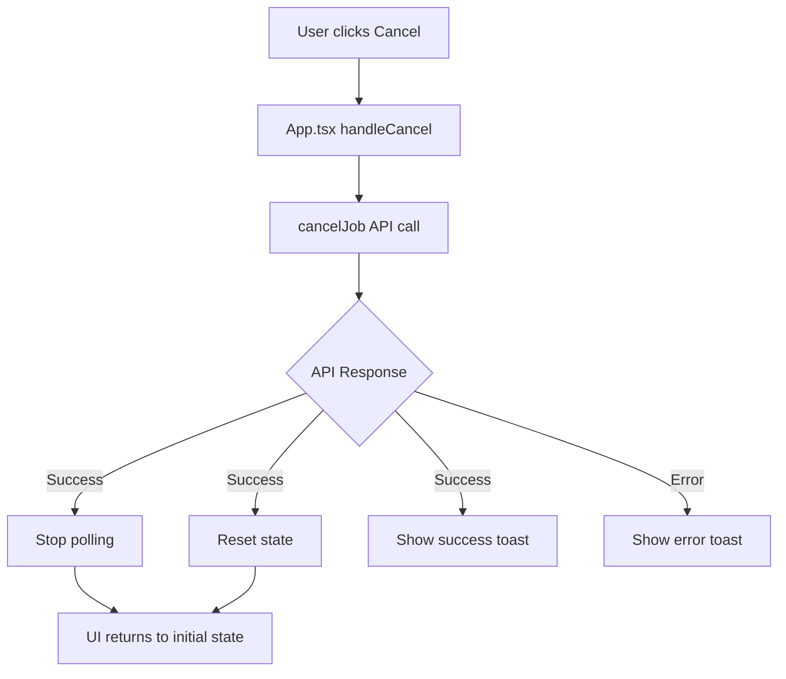

# Design Document

## Overview

This design document outlines the implementation approach for three UI improvements to the LiDAR Breakline Generator application:

1. **Information Hierarchy**: Repositioning info boxes to appear earlier in the configuration section
2. **Job Cancellation**: Adding a cancel button to allow users to terminate in-progress jobs
3. **Threshold Simplification**: Reducing the threshold range from 0-2.0 to 0.1-0.3 and removing advanced mode

These changes aim to improve user experience by making critical information more visible, providing better job control, and simplifying configuration options.

## Architecture

### Component Structure

The changes will affect the following components:

```
src/
├── App.tsx                                    # Main app - add cancel handler
├── components/
│   ├── Configuration/
│   │   ├── Configuration.tsx                  # Reorder info boxes, update layout
│   │   └── ThresholdControl.tsx              # Simplify range, remove advanced mode
│   └── Progress/
│       └── ProgressIndicator.tsx             # Add cancel button (optional location)
└── services/
    └── jobs.ts                               # Add cancelJob API function
```

### Data Flow



## Components and Interfaces

### 1. Configuration Component Changes

**File**: `src/components/Configuration/Configuration.tsx`

**Changes**:
- Move the info boxes section from the bottom of the component to appear after the section header and before the Grid Spacing control
- Maintain all existing styling and content
- Update the component structure to reflect new order:
  1. Section header (number badge + title)
  2. Info boxes (Indiana LiDAR + Data Source)
  3. Grid Spacing
  4. Threshold Control
  5. Coordinate Systems
  6. Output Formats
  7. Merge Option
  8. Process Button

**Layout Structure**:
```tsx
<div className="section-card">
  {/* Header */}
  <div className="flex items-center gap-3 mb-6">...</div>
  
  <div className="space-y-6">
    {/* NEW POSITION: Info Boxes - moved to top */}
    <div className="space-y-3">
      {/* Indiana LiDAR Reference */}
      <div className="bg-blue-50 border border-blue-200 rounded-lg p-4">...</div>
      
      {/* LiDAR Data Source */}
      <div className="bg-green-50 border border-green-200 rounded-lg p-4">...</div>
    </div>
    
    {/* Grid Spacing */}
    <div>...</div>
    
    {/* Threshold Control */}
    <ThresholdControl ... />
    
    {/* Rest of configuration options */}
    ...
  </div>
</div>
```

### 2. Threshold Control Simplification

**File**: `src/components/Configuration/ThresholdControl.tsx`

**Changes**:

1. **Update Constants**:
```typescript
const MIN_THRESHOLD = 0.1;
const MAX_THRESHOLD = 0.3;
const STEP = 0.01;
const DEFAULT_THRESHOLD = 0.1;
```

2. **Remove Preset Buttons**:
- Remove `THRESHOLD_PRESETS` constant
- Remove preset button rendering section
- Remove `handlePresetClick` function

3. **Update Slider Configuration**:
```tsx
<input
  type="range"
  min={MIN_THRESHOLD}
  max={MAX_THRESHOLD}
  step={STEP}
  value={value}
  onChange={handleSliderChange}
  className="w-full h-2 rounded-lg appearance-none cursor-pointer"
/>
```

4. **Remove Advanced Mode**:
- Remove `showAdvanced` state
- Remove toggle button
- Remove conditional rendering of numeric input section

5. **Update Slider Labels**:
```tsx
<div className="relative h-4 mt-1">
  <span style={{ left: '0%' }}>0.1</span>
  <span style={{ left: '50%' }}>0.2</span>
  <span style={{ left: '100%' }}>0.3</span>
</div>
```

6. **Update Help Text**:
```tsx
<div className="text-xs text-gray-500 space-y-1">
  <p><strong>Breakline Threshold:</strong> Controls the level of detail in generated breaklines</p>
  <p>• <strong>Lower values (0.1):</strong> Larger file size, maximum definition - captures all terrain changes</p>
  <p>• <strong>Higher values (0.3):</strong> Smaller file size, reduced definition - major terrain changes only</p>
  <p className="text-hwc-red mt-2">Default: 0.1 (recommended for most use cases)</p>
</div>
```

7. **Update Visual Gradient**:
```tsx
style={{
  background: `linear-gradient(to right,
    #EE2F27 0%,
    #EE2F27 ${((value - MIN_THRESHOLD) / (MAX_THRESHOLD - MIN_THRESHOLD)) * 100}%,
    #E5E7EB ${((value - MIN_THRESHOLD) / (MAX_THRESHOLD - MIN_THRESHOLD)) * 100}%,
    #E5E7EB 100%)`
}}
```

### 3. Job Cancellation Feature

**New API Function**: `src/services/jobs.ts`

```typescript
export const cancelJob = async (jobId: string): Promise<void> => {
  await api.delete(`/api/v1/jobs/${jobId}`);
};
```

**App Component Changes**: `src/App.tsx`

1. **Add Cancel Handler**:
```typescript
const handleCancelJob = async () => {
  if (!currentJobId) return;
  
  try {
    await cancelJob(currentJobId);
    
    // Stop polling
    setIsPolling(false);
    
    // Reset state
    setIsProcessing(false);
    setShowProgress(false);
    setCurrentJobId(null);
    setJobStatus(null);
    setUploadProgress(0);
    setJobProgress(0);
    setStatusResponse(null);
    
    toast.success('Job cancelled successfully');
  } catch (error: any) {
    console.error('Error cancelling job:', error);
    toast.error(error.response?.data?.detail || 'Failed to cancel job');
  }
};
```

2. **Add Cancel Button in Header**:
```tsx
{showProgress && (jobStatus === 'queued' || jobStatus === 'processing') && (
  <button
    onClick={handleCancelJob}
    className="px-4 py-2 bg-red-600 hover:bg-red-700 text-white text-sm font-medium rounded-lg transition-colors flex items-center gap-2"
  >
    <svg className="w-4 h-4" fill="none" stroke="currentColor" viewBox="0 0 24 24">
      <path strokeLinecap="round" strokeLinejoin="round" strokeWidth={2} d="M6 18L18 6M6 6l12 12" />
    </svg>
    Cancel Job
  </button>
)}
```

3. **Update Header Layout**:
Position the cancel button next to the status indicator in the header:
```tsx
<div className="flex items-center gap-3">
  {/* Status indicator */}
  <div className="flex items-center gap-3">
    <div className={`w-3 h-3 rounded-full ...`}></div>
    <span className="text-sm font-medium">...</span>
  </div>
  
  {/* Cancel button */}
  {showProgress && (jobStatus === 'queued' || jobStatus === 'processing') && (
    <button onClick={handleCancelJob} ...>
      Cancel Job
    </button>
  )}
</div>
```

## Data Models

### Threshold Value Constraints

```typescript
interface ThresholdConstraints {
  min: 0.1;
  max: 0.3;
  step: 0.01;
  default: 0.1;
}
```

### Cancel Job API

**Endpoint**: `DELETE /api/v1/jobs/{job_id}`

**Response**: 
- Success: 204 No Content
- Error: 404 Not Found or 500 Internal Server Error

## Error Handling

### Cancel Job Errors

1. **Job Not Found (404)**:
   - Display: "Job not found or already completed"
   - Action: Reset UI state

2. **Network Error**:
   - Display: "Failed to cancel job. Please try again."
   - Action: Keep polling active, allow retry

3. **Job Already Completed**:
   - Display: "Job has already completed"
   - Action: Continue with normal completion flow

### Threshold Validation

1. **Out of Range Values**:
   - Clamp values to [0.1, 0.3] range
   - Display warning if user attempts to set invalid value

2. **Invalid Input**:
   - Ignore non-numeric input
   - Maintain last valid value

## Testing Strategy

### Unit Tests

1. **ThresholdControl Component**:
   - Test slider changes update value within range
   - Test value clamping to [0.1, 0.3]
   - Test default value is 0.1
   - Test that preset buttons are not rendered
   - Test that advanced mode UI elements are not rendered

2. **Cancel Job Handler**:
   - Test successful cancellation resets state
   - Test error handling displays appropriate message
   - Test polling stops after cancellation

### Integration Tests

1. **Configuration Section**:
   - Verify info boxes appear before threshold control
   - Verify all configuration options remain functional
   - Verify form submission works with new threshold range

2. **Job Cancellation Flow**:
   - Test cancel button appears during processing
   - Test cancel button disappears when job completes
   - Test cancellation stops polling
   - Test UI returns to initial state after cancellation

### Manual Testing Checklist

1. **Info Box Position**:
   - [ ] Info boxes appear immediately after section header
   - [ ] Info boxes appear before grid spacing control
   - [ ] Info boxes maintain proper styling and content
   - [ ] Layout is responsive on mobile and desktop

2. **Threshold Control**:
   - [ ] Slider range is 0.1 to 0.3
   - [ ] Default value is 0.1
   - [ ] Preset buttons are not visible
   - [ ] Advanced mode toggle is not visible
   - [ ] Manual input field is not visible
   - [ ] Help text reflects new range
   - [ ] Current value displays correctly

3. **Cancel Button**:
   - [ ] Button appears when job is queued or processing
   - [ ] Button does not appear when job is completed or failed
   - [ ] Clicking button cancels the job
   - [ ] Success toast appears on successful cancellation
   - [ ] Error toast appears on failed cancellation
   - [ ] UI resets to initial state after cancellation
   - [ ] Polling stops after cancellation

## Design Decisions and Rationales

### 1. Info Box Positioning

**Decision**: Move info boxes to the top of the configuration section, but keep them within the section card.

**Rationale**: 
- Users need coordinate system information before selecting EPSG codes
- Keeping within the configuration card maintains logical grouping
- Appearing after the header but before controls provides optimal visibility
- Maintains existing styling and responsive behavior

### 2. Threshold Range Reduction

**Decision**: Reduce range from 0-2.0 to 0.1-0.3 and remove advanced mode.

**Rationale**:
- Values below 0.1 cause processing issues (per user feedback)
- Values above 0.3 produce overly simplified results with minimal benefit
- The 0.1-0.3 range covers the practical use cases:
  - 0.1: Maximum detail for flat terrain
  - 0.2: Balanced default for most scenarios
  - 0.3: Simplified output for steep terrain
- Removing advanced mode reduces cognitive load and prevents user errors
- Simpler interface aligns with user request for streamlined configuration

### 3. Cancel Button Placement

**Decision**: Place cancel button in the header next to the status indicator.

**Rationale**:
- High visibility - users can always see the cancel option
- Logical grouping with job status information
- Sticky header ensures button is always accessible during scrolling
- Consistent with common UI patterns for job control
- Does not interfere with configuration or results sections

### 5. Default Threshold Value

**Decision**: Set default threshold to 0.1 instead of 0.2 or 0.5.

**Rationale**:
- 0.1 provides maximum detail and definition
- Users can always increase the value if file size is a concern
- Better to start with more detail and simplify than miss important terrain features
- Aligns with user preference for detailed output as the default behavior

### 6. Removal of Preset Buttons

**Decision**: Remove the preset buttons (Fine Detail, Balanced, Simplified) from the threshold control.

**Rationale**:
- User feedback indicates preset buttons are confusing
- Slider provides sufficient control for the narrow 0.1-0.3 range
- Reduces visual clutter and cognitive load
- Simplifies the interface to focus on the slider control
- Current value display provides clear feedback without presets

### 4. Cancel API Implementation

**Decision**: Use DELETE method on `/api/v1/jobs/{job_id}` endpoint.

**Rationale**:
- RESTful convention: DELETE for resource removal
- Consistent with existing API patterns
- Simple implementation - no request body needed
- Backend can handle cleanup of job resources
- Idempotent operation - safe to retry

## Future Considerations

1. **Confirmation Dialog**: Consider adding a confirmation dialog before cancelling to prevent accidental cancellations

2. **Partial Results**: If backend supports it, allow downloading partial results from cancelled jobs

3. **Cancel Reason**: Track cancellation reasons for analytics and UX improvements

4. **Batch Cancellation**: If multi-job support is added, allow cancelling multiple jobs at once

5. **Threshold Presets**: Consider allowing users to save custom threshold presets within the 0.1-0.3 range
